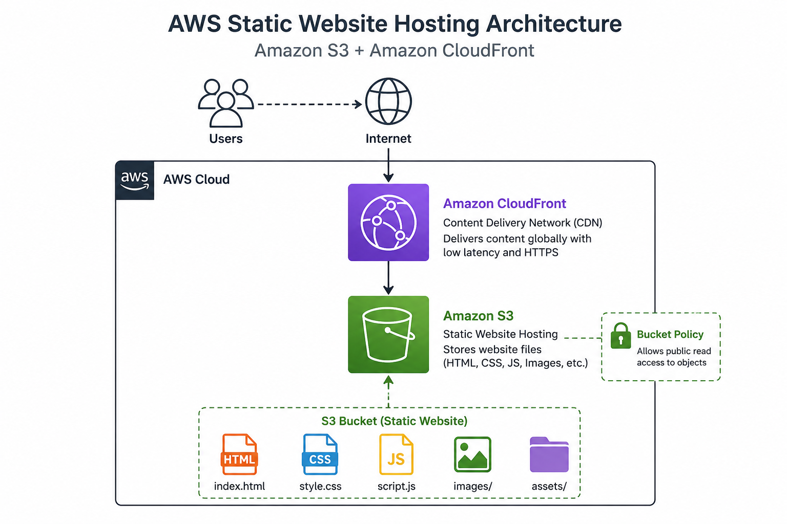
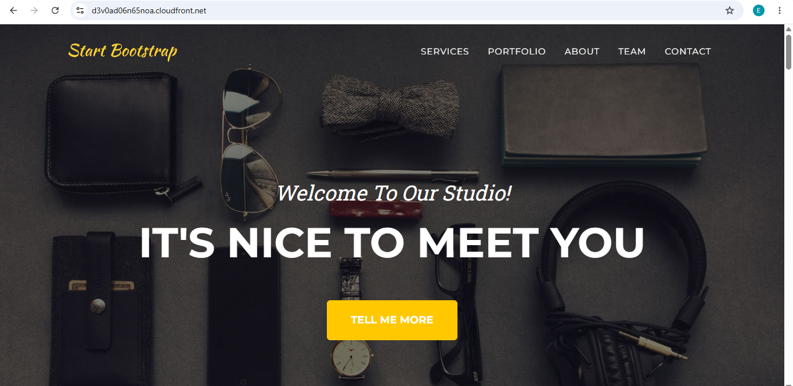
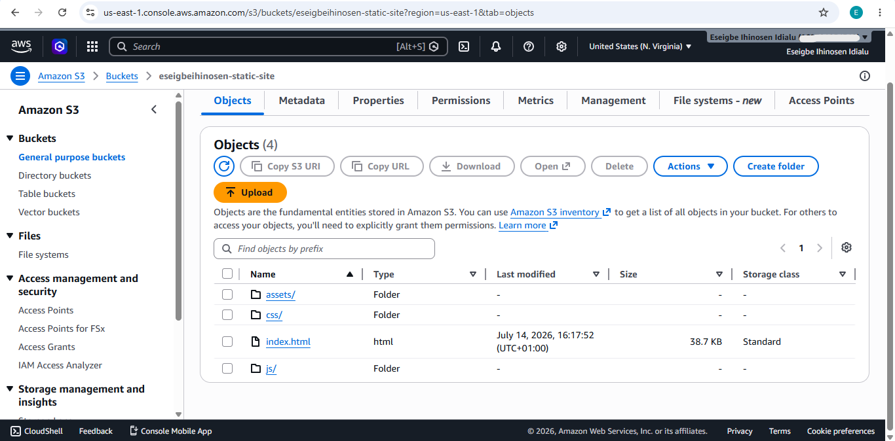
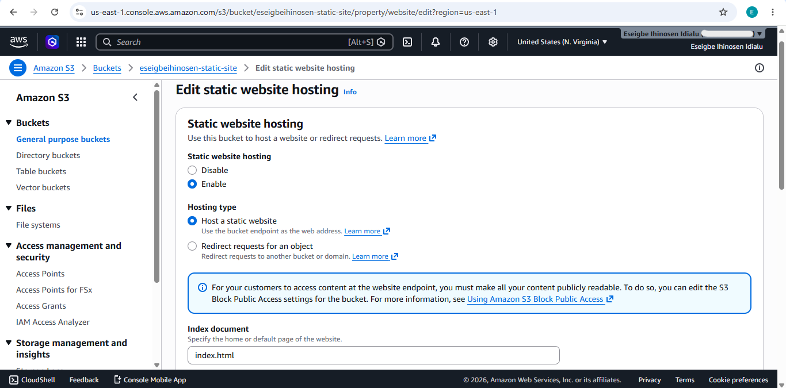
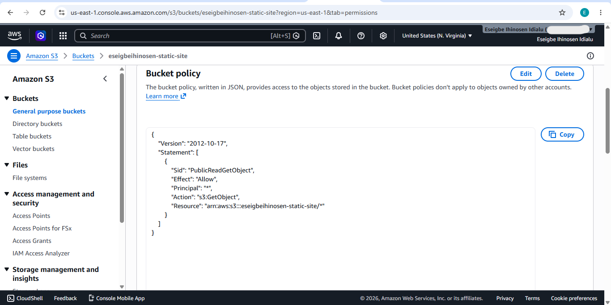
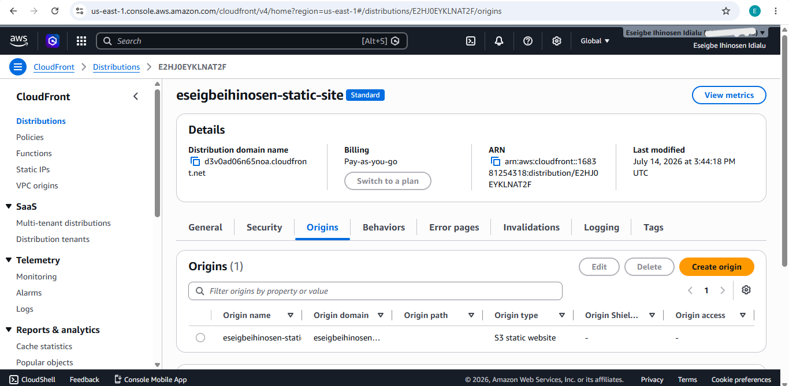
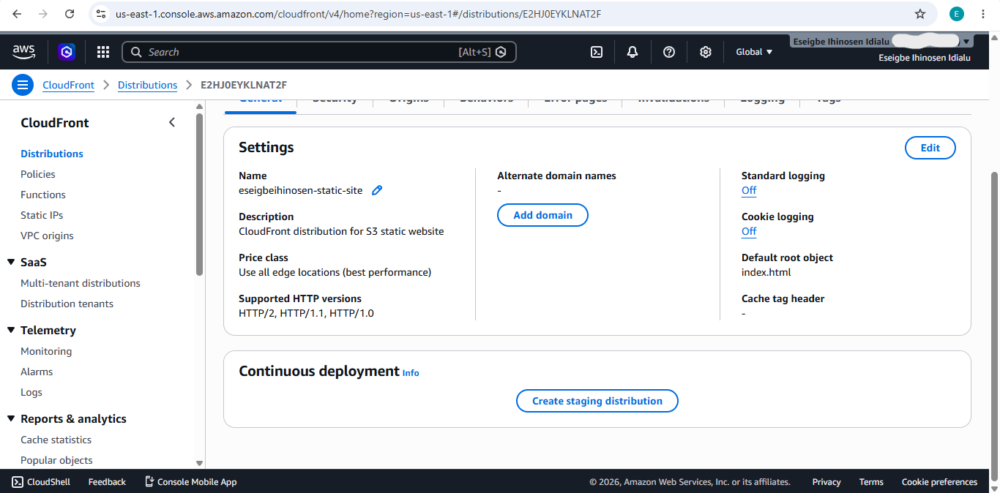

# AWS Static Website Hosting with Amazon S3 & CloudFront


A cloud project demonstrating how to host a static website using **Amazon S3** and deliver it securely over **Amazon CloudFront**.

---

## Project Overview

This project demonstrates how to deploy a static website on Amazon Web Services (AWS) using Amazon S3 for storage and CloudFront as a Content Delivery Network (CDN).

The website is publicly accessible over HTTPS through CloudFront, providing improved performance, caching, and global content delivery.

---

## Table of Contents

- [Architecture](#architecture)
- [AWS Services Used](#aws-services-used)
- [Features](#features)
- [Project Structure](#project-structure)
- [Deployment Steps](#deployment-steps)
- [Screenshots](#screenshots)
- [Skills Demonstrated](#skills-demonstrated)
- [Learning Outcomes](#learning-outcomes)
- [Author](#author)
- [License](#license)

---

## Architecture 



---

## AWS Services Used

- Amazon S3
- Amazon CloudFront
- AWS IAM
- S3 Bucket Policy
- Static Website Hosting

---

## Features

- Static website hosting using Amazon S3
- Global content delivery using Amazon CloudFront
- HTTPS delivery through Amazon CloudFront
- Static website hosted on Amazon S3
- Low-latency content delivery
- Simple and scalable architecture

---

## Project Structure

```text
aws-static-website-hosting/
│
├── assets/
├── css/
├── js/
├── screenshots/
│   ├── architecture-diagram.png
│   ├── website-homepage.png
│   ├── s3-bucket-contents.png
│   ├── s3-static-hosting.png
│   ├── bucket-policy.png
│   ├── cloudfront-distribution.png
│   └── cloudfront-settings.png
│
├── index.html
├── README.md
└── LICENSE
```

---

## Deployment Steps

### 1. Create an Amazon S3 Bucket

- Created an S3 bucket
- Uploaded website files
- Enabled Static Website Hosting
- Configured:
  - Index document: `index.html`
  - Error document: `index.html`

---

### 2. Configure Bucket Policy

Configured the bucket policy to allow public read access to the website objects.

---

### 3. Upload Website Files

Uploaded the following website files:

```text
assets/
css/
js/
index.html
```

---

### 4. Configure Amazon CloudFront

Created a CloudFront distribution with:

- Origin: S3 Static Website Endpoint
- Default Root Object: `index.html`
- HTTPS enabled
- Default cache settings

---

## Screenshots

### Website Homepage



---

### S3 Bucket Contents



---

### Static Website Hosting Configuration



---

### Bucket Policy



---

### CloudFront Distribution



---

### CloudFront Settings



---

## Skills Demonstrated

- Amazon S3
- Amazon CloudFront
- Static Website Hosting
- Content Delivery Networks (CDN)
- HTTPS Configuration
- AWS IAM
- Bucket Policies
- Cloud Architecture
- Web Hosting
- Cloud Security Fundamentals

---

## Learning Outcomes

Through this project I learned how to:

- Deploy a static website using Amazon S3
- Configure S3 Static Website Hosting
- Configure bucket policies for public access
- Create and configure a CloudFront distribution
- Serve a website securely over HTTPS
- Improve website performance using a CDN
- Understand the relationship between CloudFront and S3

---

## Author

**Eseigbe Ihinosen**

GitHub: https://github.com/eseigbeihinosen

LinkedIn: https://www.linkedin.com/in/ihinosen-eseigbe-630b88381/

---

## License

This project uses a free static website template for demonstration purposes.

Website deployed and configured on AWS by **Eseigbe Ihinosen**.